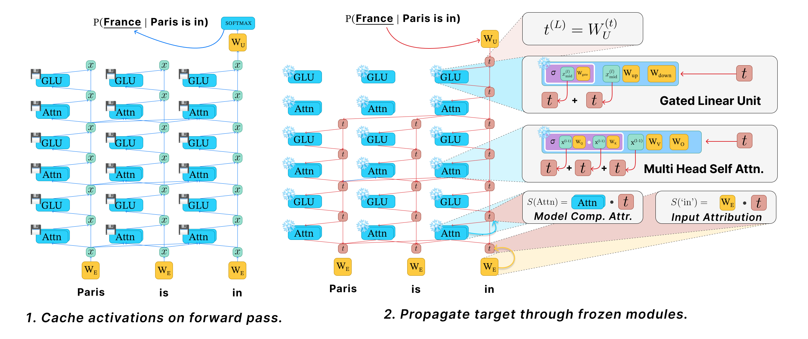

# Dual Path Attribution: Efficient Attribution for SwiGLU-Transformers through Layer-Wise Target Propagation

> Publication link: _to be added_

This repository contains the official code accompanying the paper **Dual Path Attribution (DPA): Efficient Attribution for SwiGLU-Transformers through Layer-Wise Target Propagation**.



## Introduction

Understanding which input tokens and internal model components are responsible for a transformer prediction is central to mechanistic interpretability. Existing approaches typically trade off faithfulness against computational cost: intervention-based methods are accurate but expensive, while cheaper approximations often miss important interactions or become noisy at scale.

Dual Path Attribution (DPA) addresses this trade-off for decoder-only **SwiGLU transformers**. The method decomposes computation into two complementary routes:

- a **content path**, which tracks how information is carried through value and up projections,
- a **control path**, which tracks how information is routed through attention and gating.

Using this decomposition, DPA propagates a target-specific signal backward through the frozen network with one forward pass for activation caching and one top-down target propagation pass. This yields efficient **input attribution** and **dense component attribution** without requiring a separate counterfactual intervention for each token, head, or neuron.

The repository includes:

- the core DPA tracing implementation,
- experiment drivers for attribution and ablation studies,
- benchmark subsets used in the paper,
- analysis notebooks for result aggregation and visualization.

## Repository Structure

```text
.
├── data/
│   ├── known_1000.json
│   ├── ioi.json
│   ├── squad_v2.0.json
│   ├── imdb.json
│   └── raw_data/
├── tracer/
│   ├── backend.py
│   ├── tracer.py
│   └── utils.py
└── experiments/
    ├── attribution/
    │   ├── attribution_pipe.py
    │   ├── input_attribution_modules.py
    │   ├── component_attribution_modules.py
    │   └── utils.py
    ├── ablation/
    │   ├── ablation_pipe.py
    │   └── utils.py
    ├── scripts/
    │   ├── run_attribution_experiments.sh
    │   └── run_sensitivity_anaysis.sh
    └── result_analysis/
        ├── export_attribution_runtime_memory.ipynb
        ├── plot_ablation_results.ipynb
        └── sensitivity_result_analysis.ipynb
```

## Supported Models and Data

The current implementation includes backends for the following model families and checkpoints:

- `meta-llama/Llama-2-7b-chat-hf`
- `meta-llama/Llama-3.1-8B-Instruct`
- `meta-llama/Llama-3.1-8B`
- `Qwen/Qwen3-4B-Instruct-2507`
- `Qwen/Qwen2.5-32B-Instruct`
- `mistralai/Mistral-7B-Instruct-v0.3`

The benchmark data used by the experiment pipeline is stored in `data/`:

- `known_1000` for factual knowledge,
- `ioi` for indirect object identification,
- `squad_v2.0` for reading comprehension,
- `imdb` for sentiment classification.

## Setup

The repository does not currently include a pinned environment file. A minimal environment should include:

- Python 3.10+
- `torch`
- `transformers`
- `nnsight`
- `tqdm`
- notebook and plotting packages such as `jupyter`, `matplotlib`, `pandas`, and `seaborn` for the analysis stage

A simple starting point is:

```bash
python -m venv .venv
source .venv/bin/activate
pip install torch transformers nnsight tqdm jupyter matplotlib pandas seaborn
```

Before reproducing the experiments, make sure that:

- you have access to the Hugging Face model checkpoints used in the paper,
- you have accepted any required model licenses,
- your hardware can accommodate the selected model and batch size.

## How to Reproduce the Results

The experimental workflow has three stages:

1. generate attribution scores,
2. run disruption and recovery ablations,
3. aggregate the outputs with the analysis notebooks.

### Attribution Runs

The main entrypoint is:

```bash
python -m experiments.attribution.attribution_pipe \
  --attribution input \
  --dataset known_1000 \
  --model meta-llama/Llama-3.1-8B-Instruct \
  --batch_size 4 \
  --chunk_size 4 \
  --methods dpa
```

The most important arguments are:

- `--attribution`: `input` or `component`
- `--dataset`: `known_1000`, `ioi`, `squad_v2.0`, or `imdb`
- `--model`: Hugging Face model identifier
- `--methods`: one or more attribution methods
- `--batch_size`: dataloader batch size
- `--chunk_size`: chunk size for methods that operate in chunks
- `--dpa_weights`: five weights in the order `q k v gate up`
- `--out_dir`: output root directory

The attribution modules contain both DPA and the baseline methods used in the paper.

### Ablation Runs

After attribution scores have been generated, run top-k disruption and recovery evaluations:

```bash
python -m experiments.ablation.ablation_pipe \
  --ablation input \
  --type disrupt \
  --dataset known_1000 \
  --model meta-llama/Llama-3.1-8B-Instruct \
  --batch_size 1024 \
  --out_dir ./results
```

```bash
python -m experiments.ablation.ablation_pipe \
  --ablation input \
  --type recover \
  --dataset known_1000 \
  --model meta-llama/Llama-3.1-8B-Instruct \
  --batch_size 1024 \
  --out_dir ./results
```

If `--methods` is omitted, the ablation script will evaluate all matching attribution files found in the corresponding attribution directory.

### Full Experimental Sweep

The repository includes a convenience script for the main benchmark sweep:

```bash
bash experiments/scripts/run_attribution_experiments.sh
```

This script iterates over the model, dataset, and method combinations used for the paper experiments, and then launches the associated ablation runs.

Before launching it, you will likely want to adjust:

- `CUDA_VISIBLE_DEVICES`
- batch sizes
- chunk sizes
- output directory settings

The Python drivers default to `/mnt/dacslab/dpa/results`, so on a different machine it is usually preferable to override `--out_dir` explicitly.

### Sensitivity Analysis

Sensitivity experiments for the DPA weighting configuration are provided via:

```bash
bash experiments/scripts/run_sensitivity_anaysis.sh
```

This script sweeps multiple DPA weight settings and evaluates both attribution quality and ablation behavior on `known_1000`.

## Output Files

Attribution runs create directories of the form:

```text
<out_dir>/attribution__<model_name>__<dataset>/
```

These directories contain:

- `samples.json`, with the retained evaluation examples and metadata,
- `input_<method>.pt` or `component_<method>.pt`, containing attribution scores and runtime or memory metadata.

Ablation runs create directories of the form:

```text
<out_dir>/ablation__<model_name>__<dataset>/
```

These contain per-example disruption or recovery results in JSON format.

The notebooks in `experiments/result_analysis/` consume these outputs to produce the aggregate tables and plots.

## Working with the Code

This repository is organized as an experiment artifact rather than a standalone library.

The main code paths are:

- `tracer/backend.py`: model-specific backend implementations for cached forward execution and target propagation
- `tracer/tracer.py`: the core DPA tracing logic for input and component attribution
- `experiments/attribution/`: attribution methods and the main experiment driver
- `experiments/ablation/`: faithfulness evaluation through disruption and recovery experiments
- `experiments/result_analysis/`: notebooks for exporting runtime statistics and plotting results

If you want to extend the project, the usual entry points are:

- adding a new backend in `tracer/backend.py` for another SwiGLU model family,
- adding a new dataset collation rule in `experiments/attribution/utils.py`,
- modifying the experiment scripts in `experiments/scripts/` for custom sweeps.

## Notes

- The experiment scripts load models with `torch.bfloat16` and `device_map='auto'`.
- The tokenizer is configured with left padding in the experiment pipeline.
- The attribution pipeline may write model-specific validity flags back into the dataset JSON files after filtering examples.
- Component attribution can become memory-intensive for long contexts and large models.
- Some backends assume that sliding-window attention is disabled for the corresponding architecture.

## Citation

Citation details will be added once the final publication link is available.
